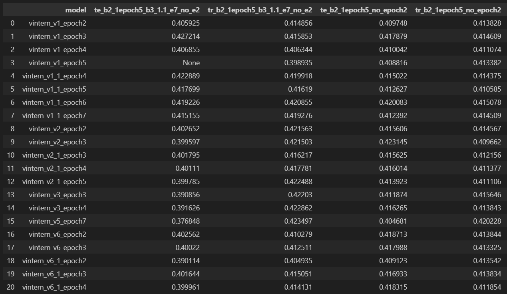
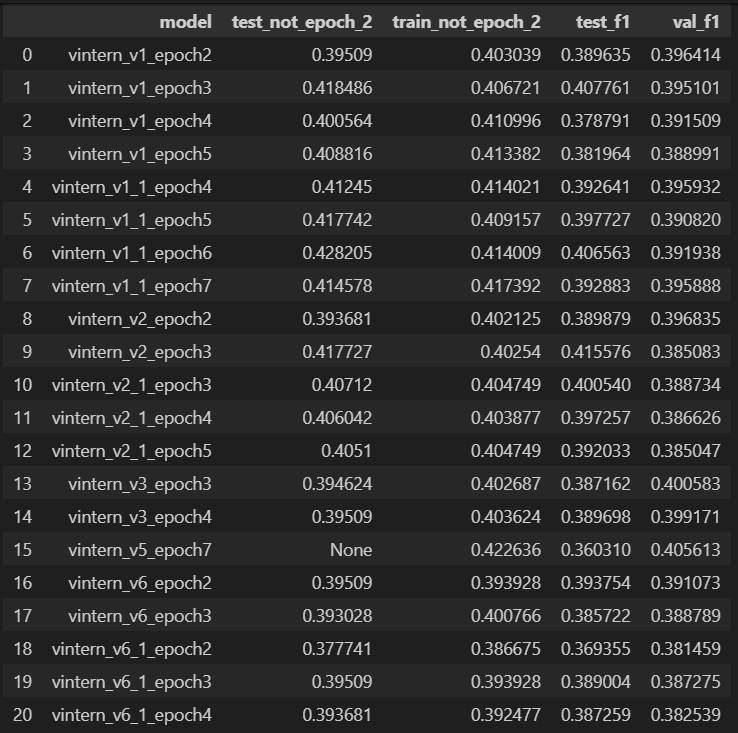

# Data-Science-Challenge-UIT-2024

## Table Of Contents
...
## Introduction
This is my submission for Group B DSC UIT 2024.
### Group B DSC UIT 2024
This year topic: **Multimodal Sacarsm Detection on Vietnamese Social Media Texts**

In this task, the participation teams have to research and propose a multimodal method that can effectively detect the sarcasm in Vietnamese image - texts dataset collected from social media platform.
### Evaluation 
The position of each proposed method is evaluated by calculating the Precision, Recall, and F1 score of their predicted labels compared to the provided labels. The partipation methods are ranked based on its F1 score. 
### Terms and Conditions
+ All teams are only allowed to use ViMMSD dataset.
+ All teams are not allowed to annotate public test data and private test data manually as well as use any data augmentation techniques.
+ Only pre-trained models in provided list by Organizers are allowed to used in this challenge. 
+ All teams must provide pre-trained embeddings and pre-trained language models that you use.
### Dataset
+ You can get train, dev and test datasets from [Kaggle](https://www.kaggle.com) by searching "DSC" or contact me. 
+ There are 4 labels: `multi-sarcasm`, `not-sarcasm`, `image-sarcasm` and `text-sarcasm`.
+ Imbalenced dataset.
+ Train dataset:
    - 10805 instances 
    - not-sarcasm: 6062
    - multi-sarcasm: 4224 
    - text-sarcasm': 77 
    - image-sarcasm': 442
+ Test dataset:
    - 1413 instances for public test
    - 1504 instances for private test
## Public test results
Here is the summerization of my results on public testset.

You can also check [this notebook](compare_val_test.ipynb) or [this csv](model.csv) for more information about my results.
## Main appoach 
### Vilt 
+ [Vilt paper summerization](papers/ViLT.ipynb)
+ Testing vilt inference code, I realized that the output is just a softmax layer, then highest probability node was used to generate one-word answer.
+ I simply changed the linear layer to a softmax layer with 4 output nodes and finetuned the model on the train dataset with CrossEntropy loss function.
+ The train dataset was first split stratifiedly into train and validation datasets, but then I [`GroupShuffleSplit`](manually_process/split_test_val.ipynb) to ensure that the same post does not appear in both train and validation datasets. (I assumed that posts with the same caption is the same post)
+ The input for the model is the caption of the image (without any preprocessing) and the image itself.
+ I first freezed the model and only trained the output layer, after it got stable, I unfreezed some layers and reduced the learning rate to finetune the model.
+ I tried many learning rates, batch sizes, epochs and unfreezed layers strategies, the best results I got for public test was about 0.39 F1 score.
+ You can see some simple note about vilt in [vilt v1](logs/vilt-v1.ipynb) and [vilt v2](logs/vilt-v2.ipynb).
+ Finetune source code for vilt: [Colab](https://drive.google.com/file/d/109Oerq2BfQdG6g3qEl0LBYiZMRbZMvsR/view?usp=sharing)
### Multilabel classification approach
+ There are some reasons why I think about this approach:
    + multi-sarcasm is both text-sarcasm and image-sarcasm.
    + not-sarcasm is both not-text-sarcasm and not-image-sarcasm.
    + The dataset is imbalanced. 
+ Based on the above reasons, I decided to use a multilabel classification approach:
    + The ouput is now 2 classes: `image-sarcasm` and `text-sarcasm` (with the assumption that `multi-sarcasm` = `text-sarcasm` + `image-sarcasm` and `not-sarcasm` = `not-text-sarcasm` + `not-image-sarcasm`)
    + The imbalance dataset is now balanced.
+ Still using Vilt but changed the output layer to a linear layer with 2 output nodes.
+ After reading [A survey about MultiLabel in DL](papers/MultiLabelDL.ipynb), I come up with:
    + `Focal lost` (for multilabel)
    + `BinaryCrossEntropy` (for multilabel)
    + `ZLPR` (for multilabel)
    + `WeightedCrossEntropy` (for multilabel - label Powerset)
    + `F1 soft` (for multilabel - label Powerset)
+ After testing with the same strategies used for base Vilt, only the results of Focal and WCE were positive, with 0.38 and 0.39 respectively.
+ You can see some simple note about vilt in [vilt focal](logs/vilt-focal.ipynb) and [vilt WCE](logs/vilt-weighted-ce.ipynb).
### Traditional data science approach
+ With the assumption that icon and hashtag provived many hints for predictions. I tried to [analyze](manually_process/text_hidden_feature.ipynb) the dataset to extract some [hidden features](emojis).
+ Testing with many traditional algorithms like LogisticRegression, SVM and Tree-based models. The results were not positive, so i stop here.
### Vintern 
+ [Vintern paper summerization](papers/Vintern-1B.ipynb)
+ After testing many models, with many constraints like:
    - Small enough (1-2B)
    - Support Vietnamese
    - Vision Language Model (public pretrained weight)
    - User-friendly api
+ I finally choosed Vintenr as my VLM model.
+ Not like Vilt, Vintern provides a modern chat-response json for input.
+ As a results, I hardly interfered deeply into the model (changing model ouput layer), but it (with HuggingFace api) already provides Lora finetune scripts. 
+ Combining with Instruction Finetune, Vintern robusted my prediction significantly:
    + [prompt 1](logs/vintern-prompt1.ipynb)
    + [prompt 2](logs/vintern-prompt2.ipynb)
    + [prompt 3](logs/vintern-prompt3.ipynb)
    + [prompt 5](logs/vintern-prompt5.ipynb)
    + [prompt 6](logs/vintern-prompt6.ipynb)

+ Most of the results were about 0.4~0.41 F1 score for best epoch of each prompt.
+ Finetune strategies:
    + For each prompt, I train each time 1 epoch, then save the model and load it for the next epoch. (Becaúse of low gpu memory and avoiding overfitting)
    + To save more VRAM, I can only lora finetune, and resize the image to smaller size.
    + I also use the same val and train group [split data](data/train_val_group_split.txt) as Vilt.
    + [jsonl extraction file for Vintern](extraction/jsonl_extraction.ipynb).
+ Explain about the prompt:
    + Prompt 1: keep the prompt simple
    + Prompt 2: show the model multi-sarcasm = text-sarcasm + image-sarcasm
    + Prompt 3: explain carefully about each label
    + Prompt 5: COT (Chain of Thought) prompt, from understand the text, image, to infer the label
    + Prompt 6: like prompt 2 but denote the icon and remove the dot, comma, slash in each word
+ Contact me to get the Vintern finetune script for this competition.

### One vs all 
+ With the idea of multilabel classification, I tried to use one vs all approach to predict each label using Vintern.
+ You can check [result ova folder](result_ova):
    + image ova: predict image-sarcasm and not-image-sarcasm
    + text ova: predict text-sarcasm and not-text-sarcasm
    + multi ova: predict multi-sarcasm and not-multi-sarcasm
    + [yes no ova](logs/vintern-yes-no.ipynb): predict sarcasm and not-sarcasm
    + [prompt 4](logs/vintern-prompt4.ipynb): predict sarcasm and not-sarcasm using COT prompt
+ Only the yes no ova and prompt 4 results were positive. 
### Stacking
#### Stack OVA
+ With the idea of combining many models to get better results, I tried to use stacking approach.
+ First, I combined the results of OVA models: 
    + text ova + image ova
    + text ova + image ova + multi ova + yes no ova
    + multi ova + yes no ova
+ I used LogisticRegression, SVM and RandomForest to stack the OVA results. Then I manually write the stacking rules. Both results were not positive.
#### Stack Base Vintern + OVA
+ Next, I tried to stack the yes no ova results with Base Vintern results:
    + Counting the frequency of each pair of predicted labels from both models.
    + Manually evaluating these label pairs against the ground truth to assess their correctness.
    + Identifying the label pairs that yield correct predictions and manually updating the Base Vintern results accordingly.
    + You can check the ideas in [this notebook](merge_approach/merge_ova_train.ipynb).

+ As you can see, the results were improved! 
+ You can check the above appoarch [here](merge_approach/ml_appoarch.ipynb)
#### Stack Base Vintern + Vintern with image sarcasm + OVA 
+ After some testing, I decided to overfit the Base Vintern, by train on more epochs(epoch 4,5,6,7 for vintern 1 and epoch 3,4,5 for vintern 2).
+ This decision comes from an assumption that the Yes No Ova can help me robust the result for not and multi sarcasm, so I need more image and text sarcasm (not that this is f1 score, not accuracy).
+ **Note**: 
    - You can realize that I nearly have no text sarcasm. 
    - This is the main problem for me to get a better result.
    - I also try to train the model on more epoch, but there is hardly any text sarcasm. 
    - I also try text-sarcasm, but the results made the stack model worse.
    - I also try Weighted CrossEntropy, and give more weight to text-sarcasm, but the results were not positive.

+ Next, I tried to stack base vintern models with Yes/No OVA and many image-sarcasm (like vintern_v1_epoch5).
+ With the same strategies like above, I manually evaluated those label pairs.

+ As you can see, the results were significantly improved again! 
+ You can check the above appoarch [here](merge_approach/ml_appoarch.ipynb)

#### Stack Base Vintern + 2nd Vintern + Vintern with image sarcasm + OVA 
+ With the same thought of stacking more models together, I tried to merge 3+ models and Yes No OVA:
    + Merge models with high score in train.
    + Merge models with high score in test.
    + Merge models with stable score in both train and test.
    + Merge models performing best in train, test and one model with stable score.
    + ...
+ Most of the merge models above performed not very well, but some of them had a stable and high f1 score. 
+ Here is the result for merge [Base Vintern] + [Vintern e1 epoch 5] + [Vintern e1.1 epoch 7] + [Yes no epoch 2]

+ You can check the results in [this notebook](merge_approach/merge_ova_train.ipynb).
#### Using ML approach to stack models
+ I also try to using traditional Machine Learning approach to decide the weight of each models.
+ You can check the above appoarch [here](merge_approach/ml_appoarch.ipynb)
+ But they are unstable, so I decided to skip this appoarch.
## Project Structure
+ data: you should put the data here
    + csv: csv files
    + json: json files
    + jsonl: jsonl files, mainly for vintern
    + *-images: image folders from competition included 3 phases
    + resized_imgaes: image folders resized for Vintern finetune 
    + weights: finetune weights for vilt and Vintern
    + train_val_group_split.txt: the file contains id for val and train (split from the original train of the competition)

+ emojis: all the icon-emoji related files
+ extraction: all the extraction files 
    + jsonl_extraction: extract jsonl for Vintern
    + extract json file (preprocess labels) for Vintern epoch 6
+ images: folder contains images for README 
+ logs: informations about Vintern and Vilt finetune.
+ manually_process: 
    + text_hidden_features files: analysis information in labels
    + split_test_val.ipynb: split train and val id 
+ merge_approach: 
    + merge_ova_test.ipynb and merge_ova_train.ipynb: files for evaluate stacking approach and save the results to files.
    + submission.ipynb: automatically convert files to results.json and results.zip 
    + merge_and_submit.ipynb: end-to-end file for submission, inputs are file name, outputs are results.zip
    + log_merge_and_submit.txt: log for merge_and_submit.ipynb
    + ml_approach.ipynb: file for stacking models using Machine Learning approach.
+ merge_test and merge_val: contains results file for merge in test and val.
+ result_ova and results_test_val: contains results file for OVA and Base Vintern approach. 
+ submissions: contains submission format files (results.json and results.zip)
+ result_private_test and submissions_private_test: Vintern-related results and merge results for private test.
+ compare_val_test.ipynb: show validation set and public test set results 
+ private_test_analysis.ipynb: merge and save the results for private test
+ models.csv: csv files for results on val, public test
+ web_image.html: host and render the image, mainly for analysis images. 
## Private test results 
I decided to choose those below models because of the stability and high f1 score on both test and train:

For the private test, I choose 3 models:
+ vintern_v1_e3: te_b2_1epoch5_no_epoch2
+ vintern_v1_1_e4: te_b2_1epoch5_b3_1.1_e7_no_e2
+ vintern_v1_1_1_e6: te_b2_1epoch5_b3_1.1_e7_no_e2

However, the final results I got on private test was just about ~0.40 f1 score 

## Technologies Used
+ Kaggle 
+ Colab 
+ Pytorch
+ Huggingface 

## Acknowledgments
+ [Vintern](https://arxiv.org/pdf/2408.12480)
+ [InternVL](https://arxiv.org/pdf/2312.14238)
+ [Deep Learning for Multi-Label Learning: A Comprehensive Survey](https://arxiv.org/pdf/2401.16549)
+ [ViLT](https://arxiv.org/pdf/2102.03334)